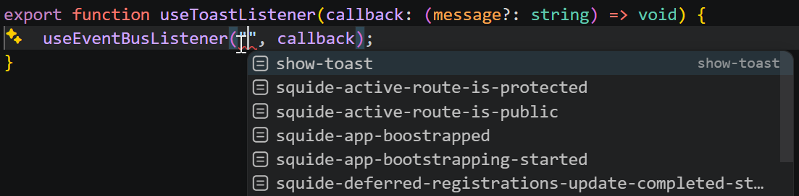

# Use the event bus

Squide provides a built-in event bus so that modules and other parts of a modular application can communicate in a loosely coupled way.

For more details, refer to the [useEventBusListener](../reference/messaging/useEventBusListener.md) and [useEventBusDispatcher](../reference/messaging/useEventBusDispatcher.md) reference documentation.

## Add an event listener

Register a function that will be invoked each time the specified event is dispatched:

```ts !#9
import { useCallback } from "react";
import { useEventBusListener } from "@squide/firefly";

const handleFoo = useCallback(data => {
    // Do something...
}, []);

// Listen to every "foo" events.
useEventBusListener("foo", handleFoo);
```

## Add an event listener that will be invoked once

Register a function that will be invoked once, and then automatically unregisters itself:

```ts !#9
import { useCallback } from "react";
import { useEventBusListener } from "@squide/firefly";

const handleFoo = useCallback(data => {
    // Do something...
}, []);

// Listen to the first "foo" event.
useEventBusListener("foo", handleFoo, { once: true });
```

## Dispatch an event

```ts !#3,6
import { useEventBusDispatcher } from "@squide/firefly";

const dispatch = useEventBusDispatcher();

// Dispatch a "foo" event with a "bar" payload.
dispatch("foo", "bar");
```

## Setup the typings

Before dispatching or listening to events, modules should [augment](https://www.typescriptlang.org/docs/handbook/declaration-merging.html#module-augmentation) the [EventMap](../reference/messaging/EventMap.md) interface with the events they intend to use to ensure type safety and autocompletion.

First, create a types folder in the project:

``` !#7-8
project
├── src
├────── register.tsx
├────── Page.tsx
├────── index.tsx
├────── App.tsx
├── types
├────── event-map.d.ts
```

Then create an `event-map.d.ts` file:

```ts !#6 project/types/event-map.d.ts
import "@squide/firefly";

declare module "@squide/firefly" {
    interface EventMap {
        // Each entry maps an event name to its payload type.
        "show-toast": string;
    }
}
```

Finally, update the project `tsconfig.json` to include the `types` folder:

```json !#5-7 project/tsconfig.json
{
    "compilerOptions": {
        "incremental": true,
        "tsBuildInfoFile": "node_modules/.cache/tsbuildinfo.json",
        "types": [
            "./types/event-map.d.ts"
        ]
    },
    "exclude": ["dist", "node_modules"]
}
```

If any other project using those events must also reference the project's `event-map.d.ts` file:

```json !#5-7 project/tsconfig.json
{
    "compilerOptions": {
        "incremental": true,
        "tsBuildInfoFile": "node_modules/.cache/tsbuildinfo.json",
        "types": [
            "../another-project/types/event-map.d.ts"
        ]
    },
    "exclude": ["dist", "node_modules"]
}
```

Once configured, the event bus hooks are fully typed:

:::align-image-left
{width=735}
:::
