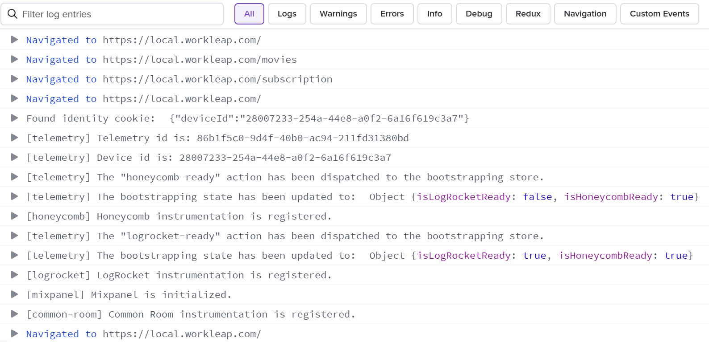

# Add a LogRocket logger

To capture logs in production, if the project is already integrated with [LogRocket](https://logrocket.com/), provide a [LogRocketLogger](https://workleap.github.io/wl-telemetry/logrocket/reference/logrocketlogger/) instance during initialization:

```tsx !#7 host/src/index.tsx
import { createRoot } from "react-dom/client";
import { FireflyProvider, initializeFirefly, type RemoteDefinition } from "@squide/firefly";
import { LogRocketLogger } from "@workleap/logrocket";
import { App } from "./App.tsx";

const runtime = initializeFirefly({
    loggers: [new LogRocketLogger()]
});

const root = createRoot(document.getElementById("root")!);

root.render(
    <FireflyProvider runtime={runtime}>
        <App />
    </FireflyProvider>
);
```

With this setup, log entries will start showing up in LogRocket's session replay:

:::align-image-left
{width=794}
:::

## Filter log entries

If the output is too verbose, filter the log entries by setting a [LogLevel](https://workleap.github.io/wl-telemetry/logrocket/reference/logrocketlogger/#filter-log-entries) option on the logger instance:

```tsx !#8 host/src/index.tsx
import { createRoot } from "react-dom/client";
import { FireflyProvider, initializeFirefly, type RemoteDefinition } from "@squide/firefly";
import { LogLevel } from "@workleap/logging";
import { LogRocketLogger } from "@workleap/logrocket";
import { App } from "./App.tsx";

const runtime = initializeFirefly({
    loggers: [new LogRocketLogger({ logLevel: LogLevel.information })]
});

const root = createRoot(document.getElementById("root")!);

root.render(
    <FireflyProvider runtime={runtime}>
        <App />
    </FireflyProvider>
);
```


